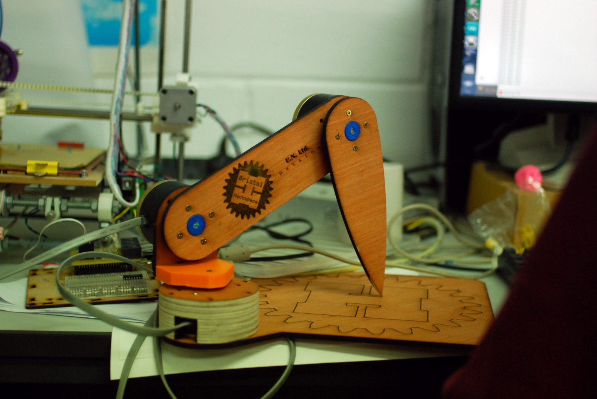

# 3D digitiser

Based on a project by [fablab.ruc.dk](http://fablab.ruc.dk/diy-digitizer/)

Initial files were taken from the [dropbox](https://www.dropbox.com/sh/vzl923vihrq4mbn/AABVBuYhJRMiPrHT0Bm9Ow42a?dl=0)

# Differences

The main difference was using [USDigital
A2](http://www.usdigital.com/products/a2) encoders, which were a lucky gift.
This changed the CAD (because they are bigger) and the software (because they
communicate over an RS485 bus and are absolute).

# Files

* [laser cut parts](cad/lasercut)
* [3d printed parts](cad/3dprint)
* [PCB](electronics)
* [Arduino code](software/arduino)
* [Processing code](software/processing)

# Licenses

* Hardware is licensed under the [CERN open hardware license 1.2](http://www.ohwr.org/attachments/2388/cern_ohl_v_1_2.txt)

* Software is licensed under a Creative Commons Attribution 4.0 International License.

